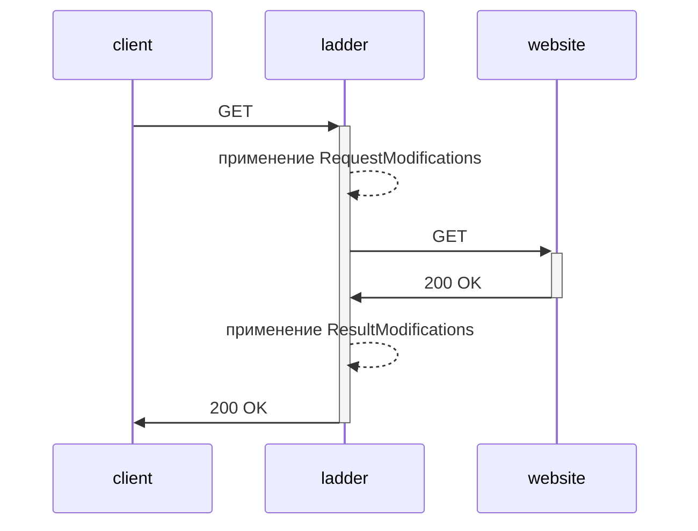

<p align="center">
    
</p>

<h1 align="center">Ladder</h1>
<div>     </div>

[English](./README.md) | [简体中文](README.zh-CN.md) | Русский

*Ladder — это HTTP веб-прокси.*

Ladder — это инструмент для разработчиков, предназначенный для тестирования и анализа реализации пейволлов и поведения доставки контента на современных веб-сайтах.

Он позволяет разработчикам, исследователям и издателям моделировать различные клиентские среды (такие как браузеры и поисковые роботы) и наблюдать, как контент предоставляется в различных условиях. Это делает его полезным для отладки конфигураций пейволлов, проверки элементов управления доступом, HTTP-заголовков и обеспечения согласованного поведения для разных пользовательских агентов.

Ladder предназначен исключительно для законного тестирования, исследований и обеспечения качества. Он должен использоваться только в соответствии с применимыми законами и условиями обслуживания целевого веб-сайта.


### Как это работает



### Возможности
- [x] Удаление/изменение заголовков CORS из ответов, ассетов и изображений ...
- [x] Удаление/изменение других заголовков (например, Content-Security-Policy)
- [x] Удаление/внедрение пользовательского кода (HTML, CSS, JavaScript) на страницу
- [x] Применение набора правил на основе домена для изменения ответа/запрашиваемого URL
- [x] Сохранение возможности просмотра сайта
- [x] API
- [x] Получение RAW HTML
- [x] Пользовательский User Agent
- [x] Пользовательский X-Forwarded-For IP
- [x] [Docker контейнер](https://github.com/everywall/ladder/pkgs/container/ladder) (amd64, arm64)
- [x] Linux бинарный файл
- [x] Mac OS бинарный файл
- [x] Windows бинарный файл (не тестировался)
- [x] Базовая аутентификация (Basic Auth)
- [x] Логи доступа
- [x] Может ломать трекинг, рекламу и другой сторонний контент
- [x] Ограничение прокси списком доменов
- [x] Предоставление доступа к набору правил для других Ladder
- [ ] Тестирование Robots.txt
- [ ] Опциональный TOR прокси
- [ ] Ключ для обмена проксированным URL

### Ограничения
Некоторые веб-сайты предоставляют разный контент (клоакинг) в зависимости от типа клиента, который получает к ним доступ (например, поисковые роботы против обычных веб-браузеров). Ladder может быть настроен для эмуляции различных типов клиентов с целью получения общедоступного контента для тестирования, автоматизации или исследовательских целей.

Однако многие веб-сайты используют продвинутые механизмы для ограничения автоматизированного доступа, такие как снятие цифровых отпечатков, ограничение частоты запросов или поведенческий анализ. Ladder не обходит такие защиты и может некорректно работать на сервисах, которые активно ограничивают или контролируют доступ.

Существуют сторонние инструменты, такие как FlareSolverr, которые могут использоваться независимо для рендеринга веб-страниц в окружении headless-браузера. Эти инструменты не являются частью Ladder, и их использование может подпадать под юридические и договорные ограничения. Пользователи несут исключительно ответственность за обеспечение соответствия своего использования всем применимым нормативным актам.

## Установка

> **Внимание:** Если ваш экземпляр будет общедоступен, обязательно включите базовую аутентификацию (Basic Auth). Это предотвратит использование вашего прокси неавторизованными пользователями. Если вы не включите Basic Auth, любой сможет использовать ваш прокси для просмотра неприятного/незаконного контента. И вы будете нести за это ответственность.

### Бинарный файл
1) Скачайте бинарный файл [здесь](https://github.com/everywall/ladder/releases/latest)
2) Распакуйте и запустите бинарный файл `./ladder -r https://raw.githubusercontent.com/everywall/ladder-rules/main/ruleset.yaml`
3) Откройте браузер (по умолчанию: http://localhost:8080)

### Docker
```bash
docker run -p 8080:8080 -d --env RULESET=https://raw.githubusercontent.com/everywall/ladder-rules/main/ruleset.yaml --name ladder ghcr.io/everywall/ladder:latest
```

### Docker Compose
```bash
curl https://raw.githubusercontent.com/everywall/ladder/main/docker-compose.yaml --output docker-compose.yaml
docker-compose up -d
```

### Helm
Смотрите [README.md](/helm-chart/README.md) в подкаталоге helm-chart для получения дополнительной информации.

## Использование

### Браузер
1) Откройте браузер (по умолчанию: http://localhost:8080)
2) Введите URL
3) Нажмите Enter

Или напрямую, добавив URL в конец URL прокси:
http://localhost:8080/https://www.example.com

Или создайте закладку со следующим URL:
```javascript
javascript:window.location.href="http://localhost:8080/"+location.href
```

### API
```bash
curl -X GET "http://localhost:8080/api/https://www.example.com"
```

### RAW
http://localhost:8080/raw/https://www.example.com


### Запуск набора правил
http://localhost:8080/ruleset

## Конфигурация

### Переменные окружения

| Переменная | Описание | Значение |
| --- | --- | --- |
| `PORT` | Порт для прослушивания | `8080` |
| `PREFORK` | Создание нескольких экземпляров сервера | `false` |
| `USER_AGENT` | Эмулируемый пользовательский агент | `Mozilla/5.0 (compatible; Googlebot/2.1; +http://www.google.com/bot.html)` |
| `X_FORWARDED_FOR` | Адрес форвардера IP | `66.249.66.1` |
| `USERPASS` | Включает базовую аутентификацию, формат `admin:123456` | `` |
| `LOG_URLS` | Логировать полученные URL | `true` |
| `DISABLE_FORM` | Отключает фронтенд с формой URL | `false` |
| `FORM_PATH` | Путь к пользовательскому HTML формы | `` |
| `RULESET` | Путь или URL к файлу набора правил, принимает локальные директории | `https://raw.githubusercontent.com/everywall/ladder-rules/main/ruleset.yaml` или `/path/to/my/rules.yaml` или `/path/to/my/rules/` |
| `EXPOSE_RULESET` | Сделать ваш набор правил доступным для других Ladder | `true` |
| `ALLOWED_DOMAINS` | Разделённый запятыми список разрешённых доменов. Пусто = без ограничений | `` |
| `ALLOWED_DOMAINS_RULESET` | Разрешить домены из набора правил. false = без ограничений | `false` |
| `FLARESOLVERR_HOST` | URL для сервиса FlareSolverr для обхода Cloudflare (опционально) | `http://localhost:8191` |

`ALLOWED_DOMAINS` и `ALLOWED_DOMAINS_RULESET` объединяются. Если оба пусты, ограничения не применяются.
| `BASE_PATH` | Базовый путь для прокси, полезно, если вы хотите запустить прокси на подпути (например, http://localhost:8080/proxy/) | `` |

### Набор правил

Можно применять пользовательские правила для изменения ответа или запрашиваемого URL. Это можно использовать для удаления нежелательных или изменения элементов на странице. Набор правил — это YAML файл, директория с YAML файлами или URL на YAML файл, содержащий список правил для каждого домена. Эти правила загружаются при запуске.

Существует базовый набор правил в отдельном репозитории [ruleset.yaml](https://raw.githubusercontent.com/everywall/ladder-rules/main/ruleset.yaml). Не стесняйтесь добавлять свои правила и создавать pull request.


```yaml
- domain: example.com          # Включает все поддомены
  domains:                     # Дополнительные домены для применения правила
    - www.example.de
    - www.beispiel.de
  headers:
    x-forwarded-for: none      # переопределить заголовок X-Forwarded-For или удалить с none
    referer: none              # переопределить заголовок Referer или удалить с none
    user-agent: Mozilla/5.0 (Macintosh; Intel Mac OS X 10_15_7) AppleWebKit/537.36 (KHTML, like Gecko) Chrome/119.0.0.0 Safari/537.36
    content-security-policy: script-src 'self'; # переопределить заголовок ответа
    cookie: privacy=1
  regexRules:
    - match: <script\s+([^>]*\s+)?src="(/)([^"]*)"
      replace: <script $1 script="/https://www.example.com/$3"
  injections:
    - position: head # Позиция, куда внедрить код
      append: |      # возможные ключи: append, prepend, replace
        <script>
          window.localStorage.clear();
          console.log("test");
          alert("Hello!");
        </script>
- domain: www.anotherdomain.com # Домен, для которого применяется правило
  useFlareSolverr: false        # Использовать FlareSolverr для обхода Cloudflare (опционально, по умолчанию: false)
  paths:                        # Пути, для которых применяется правило
    - /article
  googleCache: false            # Использовать Google Cache для получения контента
  regexRules:                   # Regex правила для применения
    - match: <script\s+([^>]*\s+)?src="(/)([^"]*)"
      replace: <script $1 script="/https://www.example.com/$3"
  injections:
    - position: .left-content article .post-title # Позиция, куда внедрить код в DOM
      replace: | 
        <h1>My Custom Title</h1>
    - position: .left-content article # Позиция, куда внедрить код в DOM
      prepend: | 
        <h2>Subtitle</h2>
- domain: demo.com
  headers:
    content-security-policy: script-src 'self';
    user-agent: Mozilla/5.0 (Macintosh; Intel Mac OS X 10_15_7) AppleWebKit/537.36 (KHTML, like Gecko) Chrome/119.0.0.0 Safari/537.36
  urlMods:              # Изменить URL
    query:              
      - key: amp        # (это добавит ?amp=1 к URL)
        value: 1 
    domain:             
      - match: www      # regex для совпадения части домена
        replace: amp    # (это изменит домен с www.demo.de на amp.demo.de)
    path:               
      - match: ^        # regex для совпадения части пути
        replace: /amp/  # (изменит URL с https://www.demo.com/article/ на https://www.demo.de/amp/article/)
```

## Интеграция с FlareSolverr

Ladder поддерживает интеграцию с [FlareSolverr](https://github.com/FlareSolverr/FlareSolverr) для обхода защиты Cloudflare и других анти-бот систем. Это особенно полезно для сайтов, использующих сложные механизмы обнаружения ботов.

### Настройка FlareSolverr

1. **Использование Docker Compose (рекомендуется):**
   ```yaml
   # docker-compose.yaml
   services:
     ladder:
       image: ghcr.io/everywall/ladder:latest
       ports:
         - "8080:8080"
       environment:
         - RULESET=https://raw.githubusercontent.com/everywall/ladder-rules/main/ruleset.yaml
         # - FLARESOLVERR_HOST=http://flaresolverr:8191
       depends_on:
         - flaresolverr
     
     flaresolverr:
       image: ghcr.io/flaresolverr/flaresolverr:latest
       ports:
         - "8191:8191"
       environment:
         - LOG_LEVEL=info
   ```

2. **Запуск FlareSolverr отдельно:**
   ```bash
   docker run -d \
     --name flaresolverr \
     -p 8191:8191 \
     ghcr.io/flaresolverr/flaresolverr:latest
   ```

   Затем запустите Ladder с URL FlareSolverr:
   ```bash
   FLARESOLVERR_HOST=http://localhost:8191 ./ladder
   ```

### Настройка правил для FlareSolverr

Чтобы использовать FlareSolverr для определённых доменов, добавьте флаг `useFlareSolverr: true` в ваш набор правил:

```yaml
# Пример набора правил с FlareSolverr
- domain: cloudflare-protected-site.com
  useFlareSolverr: true  # Включить FlareSolverr для этого домена
  headers:
    user-agent: "Mozilla/5.0 (Windows NT 10.0; Win64; x64) AppleWebKit/537.36"
    accept: "text/html,application/xhtml+xml,application/xml;q=0.9,*/*;q=0.8"

# Обычный сайт без FlareSolverr
- domain: regular-site.com
  headers:
    user-agent: "Custom User Agent 1.0"
```

### Случаи использования

Интеграция с FlareSolverr особенно полезна для:
- **Сайтов, защищённых Cloudflare**: Сайты, использующие анти-бот челленджи Cloudflare
- **Сайтов с JavaScript челленджами**: Страницы, требующие выполнения JavaScript для доступа к контенту
- **Динамической загрузки контента**: Сайты, загружающие контент динамически через JavaScript
- **Продвинутого обнаружения ботов**: Сайты, использующие сложные методы снятия цифровых отпечатков и обнаружения ботов

### Важные замечания

- FlareSolverr добавляет дополнительную задержку к запросам, так как ему нужно решать челленджи
- Включайте `useFlareSolverr` только для доменов, которым это действительно нужно, для поддержания производительности
- FlareSolverr требует больше ресурсов, так как запускает headless-браузер
- Убедитесь, что FlareSolverr запущен и доступен, прежде чем включать его в вашем наборе правил

## Разработка

Для запуска сервера разработки на http://localhost:8080:

```bash
echo "dev" > handlers/VERSION
RULESET="./ruleset.yaml" go run cmd/main.go
```

### Опционально: Сервер разработки с автоматической перезагрузкой через [cosmtrek/air](https://github.com/cosmtrek/air)

Установите air согласно [инструкциям по установке](https://github.com/cosmtrek/air#installation).

Запустите сервер разработки на http://localhost:8080:

```bash
air # или путь к air, если вы не добавили alias в ваш .bashrc или .zshrc
```

Этот проект использует [pnpm](https://pnpm.io/) для сборки таблицы стилей с классами [Tailwind CSS](https://tailwindcss.com/). Для локальной разработки, если вы изменили стили в `form.html`, запустите `pnpm build` для генерации новой таблицы стилей.
